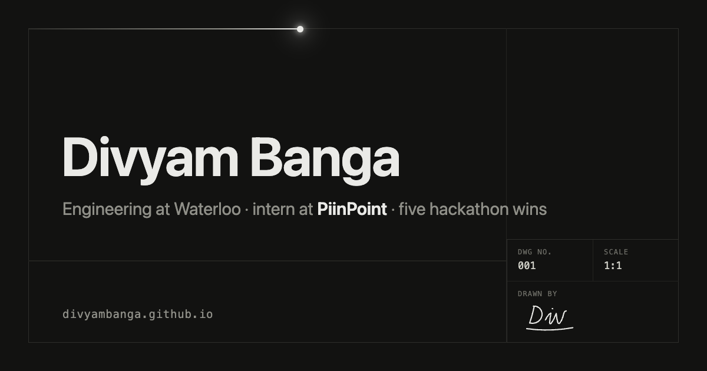

# divyambanga.github.io

Personal site. One sheet, drafted by hand. Live at [divyambanga.github.io](https://divyambanga.github.io).



Vanilla HTML, CSS and JavaScript. No framework, no build step, no images on the page. Two colors, plus whatever the ink feels like.

## The details

- **The entrance.** An invisible pen drafts the grid one hairline at a time, then signs the title block. The timeline lives in CSS custom properties; `script.js` measures the real grid and rewrites the segment durations so the pen moves at constant speed on any screen. Any click or key skips it.
- **The ink.** A small WebGL fluid simulation (stable fluids with vorticity confinement) pours dye out of the pointer. It sleeps when the ink has fully dissolved and wakes on the next movement. Descends from Pavel Dobryakov's work.
- **⌘K.** A command palette on a native `<dialog>`. Not everything is listed.
- **G.** Construction lines: the working grid the sheet was drawn on, baseline rows and registration marks included.
- **⌘P.** The sheet becomes paper. Link destinations print themselves.
- **The title block.** DWG NO. 001, a live REV date from the GitHub API, Waterloo local time, and a signature the pen draws last.

## Running it

It is static. Open `index.html`, or serve the folder:

```
python -m http.server
```

## Colophon

Type is the system stack, as your OS drew it. Dark by default, light on request, and the choice sticks. Honors `prefers-reduced-motion`. The 404 is a sheet that was never drawn.
